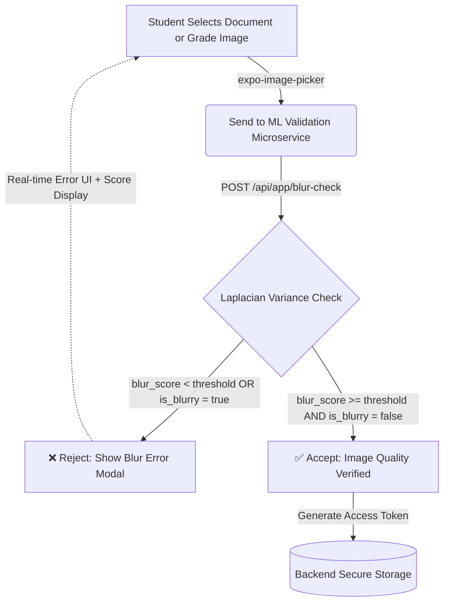
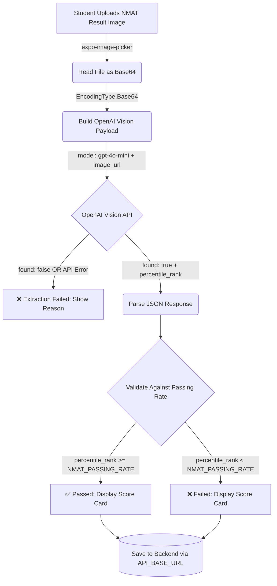

# MedSIS - Medical Student Information System

<!-- Version Badges -->
<div align="center" style="margin-bottom: 30px;">
  
  
  
  
  
  
  
  
  
  
  
</div>

**MedSIS** ( Medical Student Information System ) is a comprehensive mobile application designed for students to upload academic requirements, view evaluation results history, and manage their educational journey. This first version release focuses on streamlined document submission, evaluation tracking, and essential academic tools with AI assistance and real-time communication features.

---

## 📚 Technical Documentation Suite

Comprehensive system documentation is located in the [`docs/`](./docs) directory:

| Module | Document | Scope & Contents |
| :--- | :--- | :--- |
| **`000`** | [**System Overview**](./docs/000_IndexAndSystemOverview.md) | Master index, architecture summary, tech stack, and environment matrix |
| **`001`** | [**Architecture & Structure**](./docs/001_ArchitectureAndProjectStructure.md) | Expo Router layout, component hierarchy, and modular design |
| **`002`** | [**Authentication & Security**](./docs/002_AuthenticationAndSecurity.md) | AuthContext, login lifecycle, 2FA OTP, policy acceptance, and session encryption |
| **`003`** | [**Real-Time Messaging**](./docs/003_RealTimeMessagingAndChatSystem.md) | Peer chat, quote replies, threading, attachments, and unsend actions |
| **`004`** | [**Document Upload & AI**](./docs/004_DocumentUploadAndAiValidation.md) | 3-tier validation (blur checking, OpenAI Vision slot matching, NMAT extraction) |
| **`005`** | [**Evaluations & Prospectus**](./docs/005_StudentEvaluationAndProspectus.md) | Evaluation lifecycle, prospectus grade verification, and evaluator signatures |
| **`006`** | [**AI Assistant (MedGPT)**](./docs/006_AiAssistantIntegration.md) | Assistant architecture, instant responses, suggested queries, and live intents |
| **`007`** | [**State & Offline Caching**](./docs/007_StateManagementAndOfflineCaching.md) | AsyncStorage persistence, message caching, and offline detection |
| **`008`** | [**Push Notifications**](./docs/008_PushNotificationsAndBackgroundServices.md) | Push token registration, notification channels, and background tasks |
| **`009`** | [**UI/UX Design System**](./docs/009_UiUxDesignSystemAndTheming.md) | NativeWind Tailwind CSS v3 tokens, light/dark themes, and modals |
| **`010`** | [**Testing & Troubleshooting**](./docs/010_TestingQualityAssuranceAndTroubleshooting.md) | Quality assurance, test coverage, and troubleshooting matrix |
| **`011`** | [**Build & Deployment**](./docs/011_BuildPipelinesAndDeployment.md) | Expo EAS build pipelines, Android APK/AAB builds, and release checklists |
| **`ZZ`** | [**Legacy Archives**](./docs/ZZ_Archives/README.md) | Historical design notes and legacy reference documentation |

---

### 🧠 ML-Powered Image Quality Validation

MedSIS features an intelligent validation pipeline that utilizes a dedicated Machine Learning microservice to guarantee the legibility of academic records.

When a student selects a document (like a general academic requirement or an evaluation grade image), the file is seamlessly routed to the validation endpoint. This microservice computes the image's Laplacian variance to calculate a clarity confidence score. If the system rejects the quality due to blurriness, the upload is blocked and instant UI feedback is provided. If the system accepts the quality, the transaction generates a secure token and commits the document or grade image to storage.



---

### 🎓 NMAT Percentile Rank Extraction (OpenAI Vision)

MedSIS uses **OpenAI GPT-4o-mini Vision** to automatically extract the NMAT Percentile Rank from uploaded result documents. The student uploads their NMAT result image, which is encoded to Base64 and sent to the OpenAI Vision API. The model reads the document and returns a structured JSON response with the extracted percentile rank. The result is then validated against the passing threshold and displayed on the student's profile.



**Key implementation details:**
- Model: `gpt-4o-mini` with `response_format: json_object`
- Supports JPG, PNG, and PDF mime types
- `EXPO_PUBLIC_OPENAI_API_KEY` is required — must be set as `EXPO_PUBLIC_` prefix to be bundled into the APK at build time
- Passing rate threshold defined in `@types/screens/nmat-validation` as `NMAT_PASSING_RATE`

---

### ⚙️ Environment Configuration

MedSIS uses Expo's `EXPO_PUBLIC_` prefix convention so environment variables are correctly bundled into the APK at build time.

```env
EXPO_PUBLIC_API_BASE_URL=https://your-backend.io/
EXPO_PUBLIC_ML_API_BASE_URL=https://your-ml-service.onrender.com
EXPO_PUBLIC_OPENAI_API_KEY=sk-proj-...
EXPO_GEMINI_API_KEY=your_gemini_key
EXPO_TOKEN=your_expo_token
```

> **Important:** Only variables prefixed with `EXPO_PUBLIC_` are accessible inside the app bundle at runtime. Non-prefixed variables are available during the build script only and will be `undefined` in the APK.

For CI/CD (GitHub Actions), store the entire `.env` content as a single GitHub Secret named `ENV_FILE`. The pipeline writes it to disk before the build:

```yaml
- name: Create .env file
  run: echo "${{ secrets.ENV_FILE }}" > .env
```

---

## 📱 Download APK

**Ready to install?** Download the latest APK build:

<div align="center">
  <a href="https://drive.google.com/drive/folders/1DARepPLB5fiFQW9WmEsbbW44oSkSkGMp" target="_blank">
    
  </a>
</div>

> **Note:** Download the APK file from Google Drive and install on your Android device. Make sure to enable "Install from unknown sources" in your device settings.

## 🎓 Release v1.0.0

**Release Date:** December 5, 2025

### Streamlined Academic Records and Document Management

**MedSIS App v1.0.0** delivers a comprehensive mobile solution designed for students to efficiently manage their academic records and documents. This release focuses on core functionalities including secure document upload, real-time evaluation results tracking with e-signatures, AI-powered academic assistance, and seamless communication with faculty.

**Key Highlights:**

- 🔐 Enhanced security with OTP verification and password requirements
- 📱 Cross-platform compatibility (iOS/Android) with native performance
- 🤖 AI-powered student assistant for academic support
- 💬 Real-time messaging system with live updates
- 📊 Comprehensive evaluation tracking with e-signatures
- 🌙 Dark/Light theme support with NativeWind styling
- 🚀 **Persistent Caching**: Optimized message and chat data recovery for slow networks
- 🎓 **NMAT Extraction**: OpenAI GPT-4o-mini Vision for automatic percentile rank extraction
- ⚡ 100% test coverage ensuring reliability and stability

## Project Structure

```
MedSIS-App/  # Academic Records and Document Management System
├── app/                          # Main application screens (file-based routing)
│   ├── (tabs)/                   # Tab-based navigation screens ( Bottom Tabs)
│   │   ├── _layout.tsx          # Tab layout configuration
│   │   ├── ai-assistant.tsx     # AI chatbot interface
│   │   ├── evaluations.tsx      # Student evaluations
│   │   ├── folder.tsx           # File management system
│   │   ├── home.tsx             # Dashboard/home screen
│   │   └── profile.tsx          # User profile management
│   ├── auth/                    # Main Authentication screens
│   │   ├── login.tsx            # Login interface container
│   │   ├── otp-verification.tsx # OTP wrapper
│   │   └── policy-acceptance.tsx# Policy wrapper
│   ├── chat/                    # Chat and messaging screens
│   ├── chat-info/               # Chat information screens
│   ├── notifications/           # Notification screens
│   ├── screens/                 # Additional app screens
│   ├── _layout.tsx              # Root layout configuration
│   └── +not-found.tsx           # 404 error page
├── assets/                      # Static assets
│   ├── fonts/                   # Custom fonts (Montserrat, SpaceMono)
│   ├── images/                  # App images and icons
│   ├── sounds/                  # Notification sounds
│   └── styles/                  # Global styles and layouts
├── components/                  # Modular Component Architecture
│   ├── ai-assistant/            # Isolated AI layout and items
│   ├── auth/                    # Modals, forms & logic for login/otp/reset
│   ├── chat/                    # Messaging blocks & input areas
│   ├── evaluations/             # Modular evaluation wrappers & grade uploads
│   ├── folder/                  # Extracted requirement UI & states
│   ├── home/                    # Component break-down for dashboard screen
│   ├── nmat-validation-score/   # NMAT score card, skeleton & validation banner
│   ├── profile/                 # Separated fields and user actions for profiles
│   └── ui/                      # Platform-specific UI components
├── constants/                   # App constants and configuration
│   ├── Colors.ts                # Color definitions and themes
│   └── Config.ts                # Centralized API & key configuration (EXPO_PUBLIC_*)
├── contexts/                    # React contexts
│   ├── AuthContext.tsx          # Authentication state with live data fetching
│   ├── NetworkContext.tsx       # Network status monitoring
│   └── ThemeContext.tsx         # Theme management and dark/light mode
├── hooks/                       # Custom React hooks
│   ├── useImageAnalysis.ts      # ML blur check hook
│   ├── useNmatValidation.ts     # NMAT score fetch & pass/fail validation
│   ├── useColorScheme.ts        # Theme management
│   └── useThemeColor.ts         # Color theme utilities
├── services/                    # External services
│   ├── nmatExtractionService.ts # OpenAI GPT-4o-mini Vision NMAT extraction
│   ├── imageAnalysisService.ts  # ML blur detection service
│   ├── messageService.ts        # Real-time messaging and chat functionality
│   └── notificationService.ts  # Push notification handling
├── redux/                       # Redux state management
│   ├── actions/                 # Action creators
│   ├── reducers/                # State reducers
│   ├── store.tsx                # Redux store configuration
│   └── types.ts                 # Redux type definitions
├── docs/                        # Detailed documentation
│   ├── ARCHITECTURE.md          # System design overview
│   ├── CACHING_STRATEGY.md      # Local persistence & performance
│   ├── IMAGE_BLUR_ANALYSIS.md   # ML validation details
│   ├── STATE_MANAGEMENT.md      # Redux and Context API usage
│   └── ...
├── tests/                       # Comprehensive test suite
│   ├── auth/                    # Authentication tests
│   ├── screens/                 # Screen component tests
│   ├── services/                # Service layer tests
│   ├── components/              # UI component tests
│   ├── utils/                   # Utility function tests
│   └── test-runner.js           # Test execution and reporting
├── .env                         # Local environment variables (EXPO_PUBLIC_* prefixed)
├── .env.example                 # Environment variable template
├── global.css                   # Global CSS styles
├── tailwind.config.js           # Tailwind CSS configuration
└── nativewind-env.d.ts          # NativeWind type definitions
```

## Key Files Explained

### Core Application

- **app/\_layout.tsx** - Root layout with navigation setup and authentication checks
- **app/(tabs)/\_layout.tsx** - Tab navigation configuration with custom styling
- **contexts/AuthContext.tsx** - Global authentication state and user session management
- **constants/Config.ts** - Centralized `EXPO_PUBLIC_*` environment variable access

### Main Features

- **app/(tabs)/home.tsx** - Dashboard with announcements, quick actions, and academic overview
- **app/(tabs)/profile.tsx** - User profile with editable personal and academic information
- **app/(tabs)/ai-assistant.tsx** - AI-powered chatbot for student assistance
- **app/(tabs)/folder.tsx** - Document management and file organization system
- **app/(tabs)/evaluations.tsx** - Evaluation display with evaluator e-signatures

### NMAT Validation Pipeline

- **services/nmatExtractionService.ts** - OpenAI GPT-4o-mini Vision API call, Base64 encoding, JSON parsing
- **hooks/useNmatValidation.ts** - Fetches NMAT score from backend and validates against passing rate
- **components/nmat-validation-score/** - Score card UI, skeleton loader, and validation banner

### Authentication Flow

- **app/auth/login.tsx** - Student login with ID and password
- **app/auth/otp-verification.tsx** - Two-factor authentication via OTP with enhanced password requirements
- **app/auth/policy-acceptance.tsx** - Comprehensive privacy policy and terms acceptance

### Messaging & Communication

- **app/screens/messages.tsx** - Messages and conversations management with persistent caching
- **app/chat/[id].tsx** - Individual chat conversation screen with instant cache fallback
- **app/chat-info/[id].tsx** - Chat details and media sharing with cached resource lists

### Additional Screens

- **app/screens/announcements.tsx** - Detailed view of school announcements with lazy loading and back-to-top navigation
- **app/screens/evaluations.tsx** - View evaluation results history and evaluator e-signatures
- **app/screens/learning-materials.tsx** - Educational resources and materials
- **app/notifications/index.tsx** - Push notification management with Philippine time conversion and feedback handling

### Modular Component Architecture

The codebase has been refactored to break down monolithic screens into highly modular, reusable, and easy-to-maintain components:

- **components/auth/** - Self-contained components for complex authentication flows (modals, validation inputs)
- **components/evaluations/** - Sub-components explicitly handling student grade uploads and evaluation displays
- **components/folder/** - Reusable requirement list items and modular folder structural components
- **components/nmat-validation-score/** - Dedicated NMAT score display ecosystem (NmatScoreCard, NmatScoreSkeleton, NmatValidationBanner)
- **components/profile/**, **components/home/**, **components/chat/** - Dedicated component ecosystems for each major feature area
- **components/ui/** - Core native elements bridging React Native / iOS / Android UI primitives

## Get Started

1. Install dependencies

   ```bash
   npm install
   ```

2. Set up environment variables

   ```bash
   cp .env.example .env
   # Fill in your EXPO_PUBLIC_OPENAI_API_KEY and other values
   ```

3. Start the development server

   ```bash
   npx expo start
   ```

4. Run on device/emulator
   - Press `a` for Android emulator
   - Press `i` for iOS simulator
   - Scan QR code with Expo Go app

## Testing

1. Generate test report

   ```bash
   node tests/test-runner.js
   ```

2. View test files
   ```bash
   # Test files are available in tests/ directory
   # - tests/auth/ - Authentication tests
   # - tests/screens/ - Screen functionality tests
   # - tests/services/ - API service tests
   ```

**Test Coverage**: 100% (All tests passing)

- ✅ Authentication, Messaging, Chat, Profile, Services
- ✅ UI Components, Validation, Error Handling
- ✅ Edge Cases, Performance Optimization
- ✅ Constants-based configuration testing
- ✅ API integration with centralized config
- ✅ Cross-platform compatibility testing

## Technology Stack

- **Framework**: Expo (React Native)
- **Language**: TypeScript
- **Styling**: NativeWind (Tailwind CSS for React Native)
- **Navigation**: Expo Router (file-based routing)
- **State Management**: React Context API + Redux
- **UI Components**: Custom components with Lucide React icons
- **Image Handling**: Expo ImagePicker with fallback system
- **NMAT Extraction**: OpenAI GPT-4o-mini Vision API
- **Time Management**: Philippine timezone integration
- **Data Loading**: Lazy loading and pagination support
- **Image Analysis**: ML-powered blur detection and quality assessment
- **Caching**: Multi-layered AsyncStorage persistence for offline-first capabilities
- **Configuration**: Centralized `EXPO_PUBLIC_*` environment variable management
- **Testing**: Comprehensive test suite with constants-based configuration

## Features

### Authentication & Security

- 🔐 Enhanced OTP verification with strengthened password requirements
- 🔑 Password validation including uppercase, numbers, special characters, and length requirements
- 📋 Comprehensive privacy policy acceptance with detailed terms
- 🛡️ Secure session management with live data fetching

### User Experience

- 👤 Advanced profile management with live avatar fetching and SWU head fallback
- 📅 Accurate calendar system with Philippine timezone support
- 🔔 Smart notifications with feedback separation and time conversion

### NMAT Validation & Extraction

- 🎓 **OpenAI Vision Extraction** - GPT-4o-mini reads NMAT result documents automatically
  - Base64 image encoding for API transmission
  - Structured JSON response parsing (`found`, `percentile_rank`, `reason`)
  - Pass/fail validation against `NMAT_PASSING_RATE` threshold
  - Score card UI with skeleton loading state
- 🔑 `EXPO_PUBLIC_OPENAI_API_KEY` — correctly prefixed for APK bundle inclusion

### Document Management & Quality Control

- 🖼️ **Image Blur Analysis** - ML-powered quality check before upload
  - Laplacian variance blur detection via `/api/app/blur-check`
  - Quality scoring system (0-100%)
  - Auto-validation with visual progress indicators
  - Prevents upload of blurry documents
- 📁 Enhanced document management with image viewer improvements
- 📢 Announcements with lazy loading (10 items per batch) and back-to-top navigation

### Core Functionality

- 🤖 AI-powered student assistant
- 💬 Real-time messaging and chat system with live updates
- 📊 View evaluation results history with evaluator e-signatures
- 📚 Learning materials access and download
- ⏰ Real-time calendar events with proper time alignment
- 🔄 Pull-to-refresh functionality across screens
- ⚙️ Centralized `EXPO_PUBLIC_*` configuration management
- 🌙 Dark/Light theme support
- 📱 Cross-platform compatibility (iOS/Android)

## Version 1.0.0

### Core Features

- ✅ ML-powered image blur analysis for document quality control
- ✅ NMAT percentile rank extraction via OpenAI GPT-4o-mini Vision
- ✅ Student requirement upload system with document management
- ✅ View evaluation results history and evaluator e-signatures
- ✅ Secure authentication with OTP verification
- ✅ Real-time messaging and communication system with persistent caching
- ✅ AI-powered student assistant for academic support
- ✅ "Zero-Latency" feel with instant fallback for chat and info screens
- ✅ Philippine timezone integration for accurate scheduling
- ✅ Dark/Light theme support
- ✅ Comprehensive privacy policy and terms acceptance
- ✅ Academic calendar with events and deadlines
- ✅ Grade tracking and performance analytics
- ✅ Push notification system with feedback handling
- ✅ File management and document organization
- ✅ Profile management with avatar system
- ✅ Centralized `EXPO_PUBLIC_*` API configuration management
- ✅ Cross-platform compatibility (iOS/Android)
- ✅ Comprehensive test suite with 100% coverage
- ✅ NativeWind styling for consistent UI/UX
- ✅ TypeScript implementation for type safety
